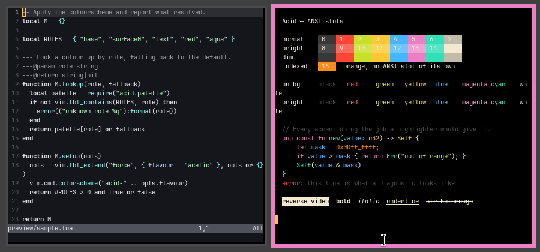
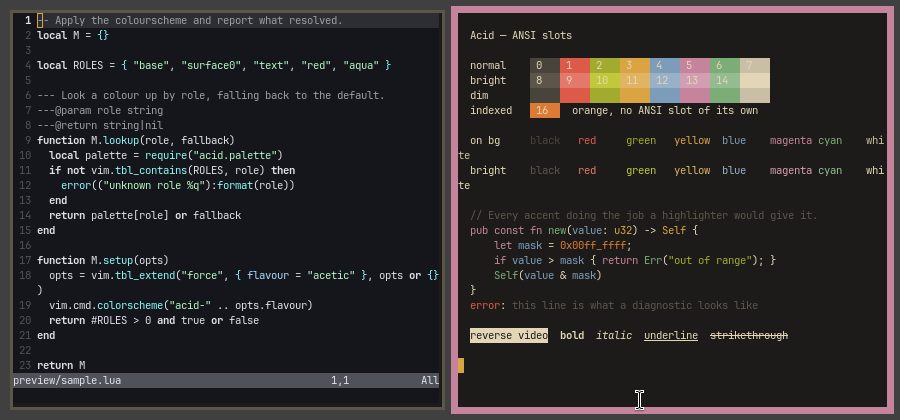

# Acid for niri

Two flavours: **Acetic** (`#000000`), vibrant, and **Citric** (`#1c1b19`), muted.

Part of [Acid](https://github.com/acid-theme/acid), a very dark colourscheme in two
flavours. The main README lists the other ports.

## Preview

| Acetic | Citric |
| --- | --- |
|  |  |

## Install

```sh
curl -fsSLo ~/.config/niri/acid-acetic.kdl \
  https://raw.githubusercontent.com/acid-theme/niri/main/acid-acetic.kdl
```

Two `layout` blocks in one file are a duplicate-node error, but niri merges a
`layout` block that arrives through `include`, so the theme carries the colours
while the main config keeps the geometry:

```kdl
include "acid-acetic.kdl"

layout {
    gaps 4
    border {
        width 0.5
    }
}
```

Remove the `active-color`, `inactive-color` and `urgent-color` lines from the
local blocks. Setting the same key on both sides still validates, but which one
wins is unspecified. Check with `niri validate` before reloading.

## Files

- `acid-acetic.kdl`
- `acid-citric.kdl`

## Generated

Acid 0.1.0, rendered by acidify from
[`ports/niri/acid.kdl.tera`](https://github.com/acid-theme/acid/blob/main/ports/niri/acid.kdl.tera).
Edits to these files are overwritten on the next release. Report issues on
[acid-theme/acid](https://github.com/acid-theme/acid/issues).

## Licence

MIT.
