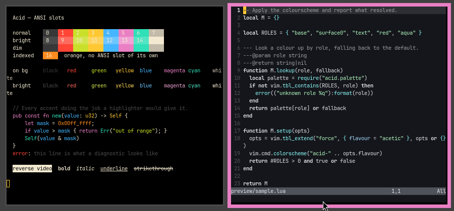
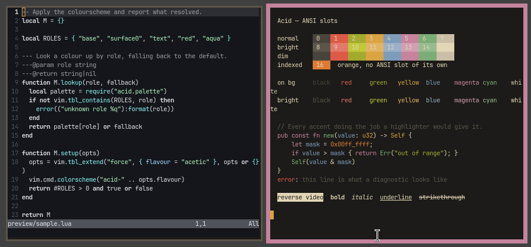
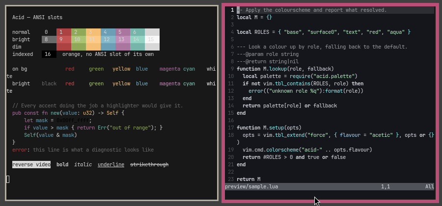

# Acid for niri

Generated from [acid-theme/acid](https://github.com/acid-theme/acid) — open issues
and pull requests there.

<details>
<summary>Screenshots</summary>

| Acetic | Citric | Lactic |
| --- | --- | --- |
|  |  |  |

</details>

## Install

```sh
curl -fsSLo ~/.config/niri/acid-acetic.kdl \
  https://raw.githubusercontent.com/acid-theme/niri/main/acid-acetic.kdl
```

Two `layout` blocks in one file are a duplicate-node error, but niri merges a
`layout` block that arrives through `include`, so the theme carries the colours
while the main config keeps the geometry:

```kdl
include "acid-acetic.kdl"

layout {
    gaps 4
    border {
        width 0.5
    }
}
```

Remove the `active-color`, `inactive-color` and `urgent-color` lines from the
local blocks. Setting the same key on both sides still validates, but which one
wins is unspecified. Check with `niri validate` before reloading.

## Credits

[@ssiyad](https://github.com/ssiyad)
